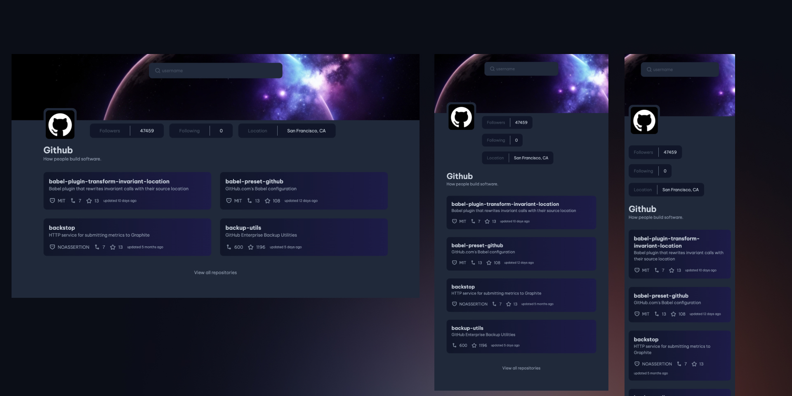

# GitHub Profile Viewer

**GitHub Profile Viewer** is a sleek, single-page web application that allows users to explore GitHub profiles effortlessly. Simply enter a GitHub username, and the app fetches and displays the user's profile details, including repositories, followers, and more. Built with modern web technologies, it provides a seamless and responsive experience for discovering GitHub profiles.

## Live site

https://github-profile-olive-phi.vercel.app/

## Screenshots
  
*Fully responsive single page app.*

## Features

- View GitHub user profiles with their basic information, including username, avatar, bio, followers, following, and location.
- Search for GitHub users by username.
- Display the latest repositories of a GitHub user
- Responsive design for seamless viewing across different devices and screen sizes.

## Technologies Used

- **React**: A JavaScript library for building user interfaces.
- **Vite**: A fast build tool that provides instant server start and fast hot module replacement (HMR) for React.
- **JavaScript**: The programming language used to build the application.
- **GitHub API**: Used to fetch user profiles and repositories from GitHub.
- **Tailwind CSS**: Utility-first CSS framework for rapidly building custom designs

## Getting Started

### Prerequisites

- Node.js installed on your local machine.
- npm or Yarn package manager.

### Installation

1. Clone the repository:

   ```bash
   git clone https://github.com/zeynabmvs/github-profile.git
   ```

2. Navigate to the project directory:

   ```bash
   cd github-profile-viewer
   ```

3. Install dependencies:

   ```bash
   npm install
   ```

4. Running the Application

   ```bash
   npm run dev
   ```

## Usage

- Enter a GitHub username in the search input field to view the profile and repositories of the corresponding user.
- Click on the "View all repositories" link to see all repositories of the user.

## Contributing

Contributions are welcome! Feel free to open issues or submit pull requests.

## Credit

The **GitHub Profile Viewr** challenge is part of the [DevChallenges](https://devchallenges.io/) platform, which provides real-world coding challenges to help developers improve their skills. The goal of this challenge is to build a responsive GitHub profile page using HTML, CSS, and JavaScript (or any framework/library of your choice).
